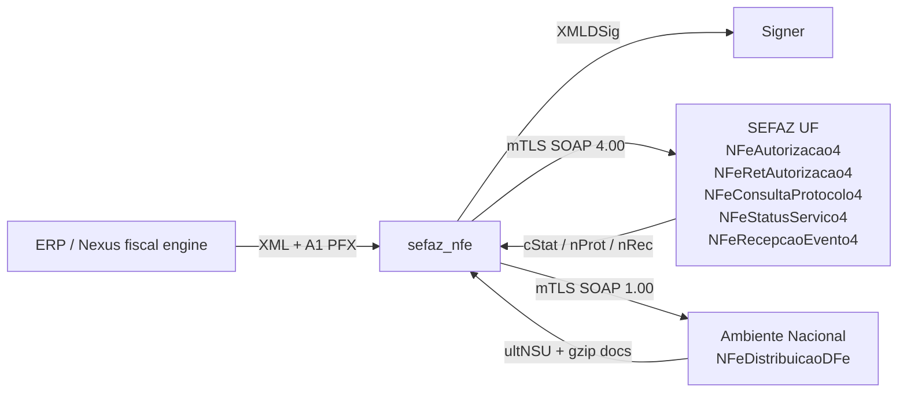

# transport-mvp Design

**Spec**: `.specs/features/transport-mvp/spec.md`  
**Status**: Draft — pending user confirm of spec

---

## Architecture Overview

The library is a **pure client** for the RFB/ENCAT NF-e 4.00 SOAP stack. Host apps (Nexus) own XML, numbering, NSU cursor, and retries.



Official service names and versions (portal **WebServices**, consulted 2026-09-07 via public listings; URLs differ per UF):

| Serviço | Versão | Papel no MVP |
| --- | --- | --- |
| NFeAutorizacao4 | 4.00 | Envio do lote (SEFAZ-01) |
| NFeRetAutorizacao4 | 4.00 | Recibo → protocolo (SEFAZ-02) |
| NFeConsultaProtocolo4 | 4.00 | Consulta por chave (SEFAZ-08) |
| NFeStatusServico4 | 4.00 | Saúde do autorizador (SEFAZ-05) |
| NFeRecepcaoEvento4 | 4.00 | Cancel / CCe (P2) |
| NFeInutilizacao4 | 4.00 | Inutilização (P3) |
| NFeDistribuicaoDFe | 1.00 | Documentos contra o CNPJ (SEFAZ-06/07) — **AN only** |

Authorization URLs are **per UF** (own SEFAZ, SVAN, or SVRS). DistDFe is **only** AN:  
`https://www1.nfe.fazenda.gov.br/NFeDistribuicaoDFe/NFeDistribuicaoDFe.asmx` (produção).

Contingency SVC-AN / SVC-RS exist as separate URL sets on the same portal; v1 does not auto-switch (AD-005).

Schemas: [lista de esquemas XML](https://www.nfe.fazenda.gov.br/portal/listaConteudo.aspx?tipoConteudo=BMPFMBoln3w=) (PL_010 / NT 2025.002 RTC, CNPJ alfa, etc.). The lib vendors a **hashed zip**; refresh is a data change.

---

## Code Reuse Analysis

### Existing Components to Leverage

| Component | Location | How to Use |
| --- | --- | --- |
| `Acbr.Client` behaviour | `nexus_pro/lib/nexus_pro/integrations/acbr/client.ex` | **Shape** of host integration later (`submit_nfe`, `get_nfe_status`, `download_xml`). Do not depend on Nexus from this Hex package. |
| nfephp `storage/wsnfe_4.00_mod55.xml` | [nfephp-org/sped-nfe](https://github.com/nfephp-org/sped-nfe) | **Mirror** of UF URLs for bootstrapping the snapshot; always re-check portal |
| `:public_key` / OTP crypto | Erlang/OTP 29 | PFX decode, TLS |
| `:telemetry` | OTP | SEFAZ-14 |
| Req or Mint | Hex | HTTPS + client cert (Execute picks one; must support mTLS) |

### Integration Points

| System | Integration Method |
| --- | --- |
| Nexus Pro | Future adapter implementing `Acbr.Client` (or a renamed `Fiscal.Provider`) calling `SefazNfe` |
| SEFAZ UF / AN | SOAP 1.2 over HTTPS, client certificate |
| Official portal | Manual/scripted refresh of endpoints + XSD |

This repo starts empty of SOAP code — no local reuse yet.

---

## Components

### `SefazNfe.Certificate`

- **Purpose**: Load A1 PFX, expose TLS cert/key and signing key without logging secrets.
- **Location**: `lib/sefaz_nfe/certificate.ex`
- **Interfaces**:
  - `load(pfx_binary, password) :: {:ok, t()} | {:error, :invalid_certificate}`
- **Dependencies**: OTP crypto
- **Reuses**: none

### `SefazNfe.Signer`

- **Purpose**: Enveloped XMLDSig on `infNFe` or event `infEvento`.
- **Location**: `lib/sefaz_nfe/signer.ex`
- **Interfaces**:
  - `sign_nfe(xml, cert) :: {:ok, xml} | {:error, term()}`
  - skip if already signed (SEFAZ edge case)
- **Dependencies**: Certificate; XML canonicalization per MOC (algorithm **confirmed from MOC at Execute**, not invented here)
- **Reuses**: none

### `SefazNfe.Endpoints`

- **Purpose**: Resolve `{uf, ambiente, service}` → URL.
- **Location**: `lib/sefaz_nfe/endpoints.ex` + `priv/endpoints/nfe_4.00.json`
- **Interfaces**:
  - `url(uf, ambiente, service) :: {:ok, uri} | {:error, {:unknown_endpoint, ...}}`
- **Dependencies**: snapshot file + documented refresh
- **Reuses**: portal / nfephp mirror as input to the snapshot

### `SefazNfe.SOAP`

- **Purpose**: mTLS POST, parse SOAP fault vs body.
- **Location**: `lib/sefaz_nfe/soap.ex`
- **Interfaces**:
  - `call(endpoint, body, cert, opts) :: {:ok, xml_body} | {:error, term()}`
- **Dependencies**: HTTP client with client cert; timeouts from opts (no internal Autorizacao retry)
- **Reuses**: none
- **Test double**: `SefazNfe.SOAP` is a behaviour; `mix test` never opens a socket

### `SefazNfe.Authorize` / `RetAuthorize` / `Status` / `Consulta` / `DistDFe`

- **Purpose**: One module per official service; build SOAP envelope, map `cStat`.
- **Location**: `lib/sefaz_nfe/*.ex`
- **Interfaces**: as spec P1 functions on `SefazNfe` facade
- **Dependencies**: SOAP, Endpoints, Signer, Certificate
- **Reuses**: none

### `SefazNfe.Schema` (P2)

- **Purpose**: Optional XSD validation against vendored official schemas.
- **Location**: `lib/sefaz_nfe/schema.ex` + `priv/schemas/`
- **Interfaces**: `validate(xml, schema_id) :: :ok | {:error, {:schema, [reason]}}`

---

## Data Models (if applicable)

Library structs only — no DB.

```elixir
# illustrative — names may change at Execute
%SefazNfe.Result{
  status: :autorizada | :lote_recebido | :rejeitada | :processando,
  c_stat: pos_integer(),
  x_motivo: String.t(),
  ch_nfe: String.t() | nil,
  n_prot: String.t() | nil,
  n_rec: String.t() | nil,
  xml: String.t() | nil
}

%SefazNfe.DistDFe.Page{
  ult_nsu: String.t(),
  max_nsu: String.t(),
  c_stat: pos_integer(),
  documents: [%SefazNfe.DistDFe.Document{schema: String.t(), nsu: String.t(), xml: String.t()}]
}
```

**Relationships**: none persisted. DistDFe cursor is owned by the caller.

Known `cStat` values we **assert in tests** (MOC; not an exhaustive table):

| cStat | Meaning we rely on |
| --- | --- |
| 100 | Autorizado o uso da NF-e |
| 103 | Lote recebido com sucesso |
| 104 | Lote processado |
| 105 | Lote em processamento |
| 107 | Serviço em operação |

Other codes are passed through as `:rejeitada` / raw `c_stat`. Do not invent a complete dictionary in v1.

---

## Error Handling Strategy

| Error Scenario | Handling | User Impact |
| --- | --- | --- |
| Bad PFX / password | `{:error, :invalid_certificate}` | Host shows config error; no SEFAZ call |
| Timeout after possible accept | `{:error, :timeout}` — **no retry** | Host consults chave/recibo |
| HTTP 5xx / SOAP fault | `{:error, {:http, _} \| {:soap_fault, _}}` | Host retries with backoff |
| SEFAZ business reject | `{:ok, %{status: :rejeitada, c_stat, x_motivo}}` | Host maps to order/fiscal document |
| Unknown UF endpoint | `{:error, {:unknown_endpoint, uf, service}}` | Host must not emit |
| ambiente vs tpAmb mismatch | `{:error, :ambiente_mismatch}` | Prevents homolog XML in produção |
| Consumo indevido (DistDFe) | `{:ok, %{c_stat: ...}}` | Host (Oban) backs off |

---

## Risks & Concerns

| Concern | Location | Impact | Mitigation |
| --- | --- | --- | --- |
| Official portal often blocks automated fetch | nfe.fazenda.gov.br | Stale endpoints | Manual refresh documented in wiki; snapshot + date |
| XMLDSig + C14N in Erlang is the hard part | Signer | Invalid signature → reject 280/etc | Homolog as first Execute gate; compare with a XML signed by NFePHP in a fixture test |
| SHA-1 vs SHA-256 for signature | MOC annex | Wrong digest = 100% reject | Read current MOC at Execute; add a fixture from a known-good signed NF-e |
| XSD vs reforma (PL_010) | priv/schemas | False local rejects | XSD optional; default on only in homolog config of the **host** |
| mTLS + government TLS stacks | SOAP | Cipher/root CA issues (AC Raiz v5) | Document required CAs; fail with TLS reason |
| No Elixir predecessor | Hex | We are the reference | Keep surface small; behaviour for SOAP |

---

## Tech Decisions (only non-obvious ones)

| Decision | Choice | Rationale |
| --- | --- | --- |
| Stateless Hex vs OTP app | Library, no Application supervision required | AD-002; Nexus owns Oban |
| One NF-e per authorize call | Yes | Matches Nexus per-order worker; lote de 50 later |
| Retry Autorizacao inside lib | Never | Duplicate nNF risk |
| Endpoint source of truth | RFB portal; vendored snapshot | AD-004 |
| Test SOAP | Behaviour + stub | `mix test` offline |
| Language | Elixir / OTP 27+ (project uses 1.20 / OTP 29) | Host stack |

Project-level decisions already in `.specs/STATE.md` (AD-001 … AD-005).
